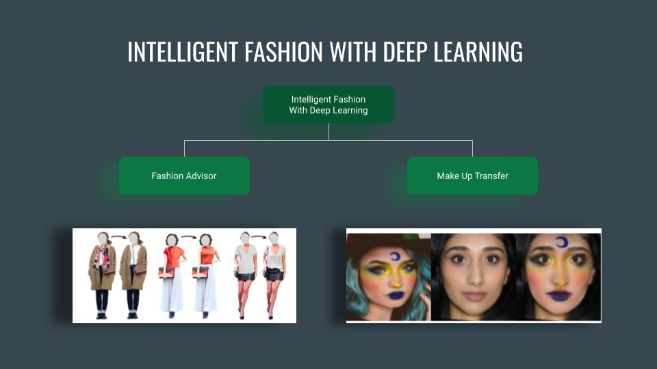
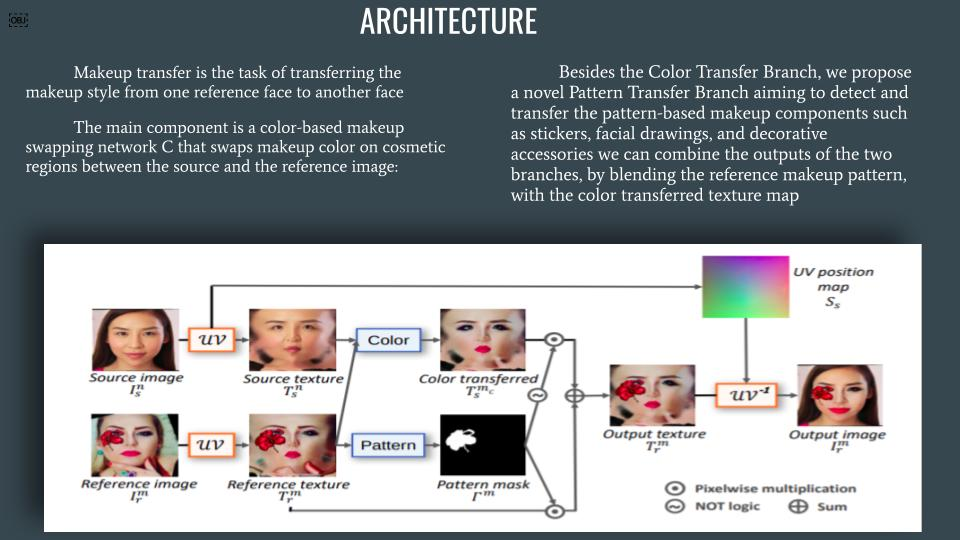

# Intelligent Fashion System

Developed an interactive web platform to improve the user experience while shopping online. 

In the present situation, it is not possible for people to shop as they use to do earlier. This is a major problem in case of fashion industry. So we have come up a deep learning based approach where people can try and find the best outfit and accessories for them in the comfort of their home.

## Fashion Advisor

### Main Idea

A recommendation system that suggests the user what minimal changes in his/her dress can make him/her look more fashionable. This helps the user to get better idea of what size and color he/she should pick for them.

### Implementation

This is an implementation of this paper: [Fashion++: Minimal Edits for Outfit Improvement](https://arxiv.org/pdf/1904.09261.pdf)

#### About the Architecture
The system uses a discriminative fashionability classifier that is trained on thousands of publicly available images of outfits that have been judged to be stylish. These serve as ground truth examples of fashionable outfits, and unfashionable examples are then bootstrapped by swapping garments on the fashionable examples with their least similar counterparts.

Once the classifier is trained, our system gradually updates the outfit in order to make it more fashionable. An image-generation neural network renders the newly adjusted look, using a variational auto-encoder to generate the silhouette and a conditional generative adversarial network (cGAN) to generate the color and pattern. 
 

## Make Up Transfer

### Main Idea

A generative adversial model to that transfers the makeup style of a person to other person's face. Using this network, user can try different make up styles and select which suits them the best.

## How to use

